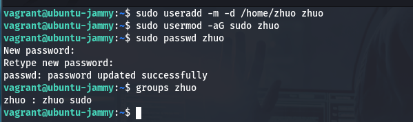
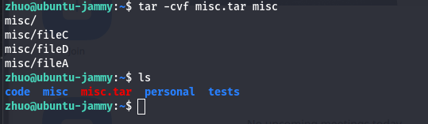
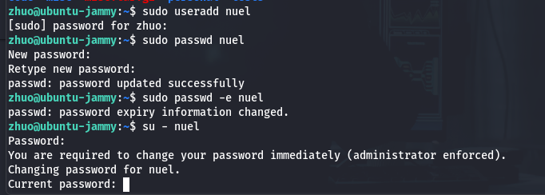
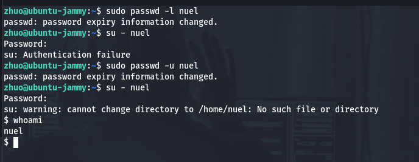
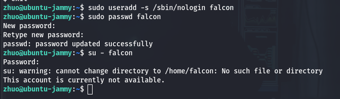
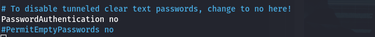
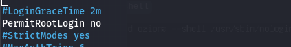

# AltSchool Cloud Engineering - Second Semester - Exercise 1

## Solutions

`set up new user with home directory`

`create new directories within the home directory`

1. `change directory using the absolute pathname`

2. `change directory using the relative pathname`

3. `create new file with text in specified directory using echo command`

4. `create empty file in the misc directory, then add dummy content.`

5. `Copy contents of fileA into fileC`

6. `Move contents of fileB into fileD`

7. `Create a tar archive called misc.tar for the contents of misc directory`

8. `Compress the tar archive to create a misc.tar.gz file`

9. `Create a user and force the user to change his/her password upon login`

10. `Lock a users password` `unlock user's password to ensure lock worked`

11. `Create a user with no login shell`

12. `Disable password-based authentication for ssh`

    

13. `Disable root login for ssh`

`restart ssh service`

.restart-ssh-service.png)
